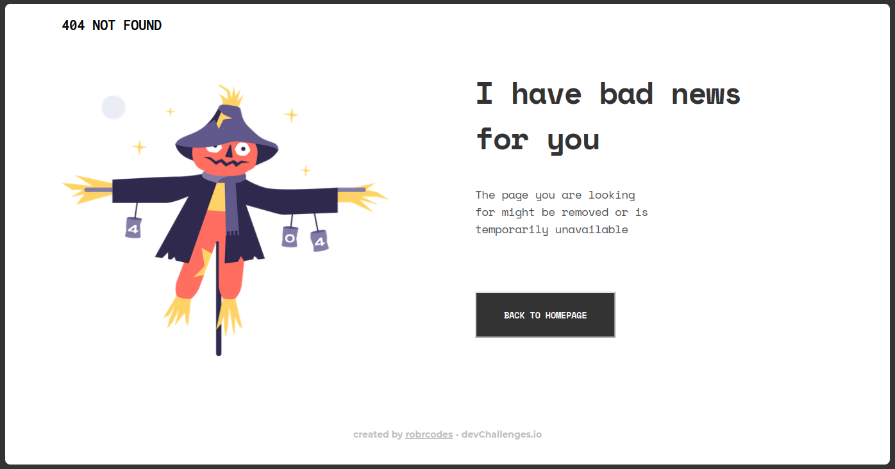

<h1 align="center">404 Not Found Page</h1>

   Solution for a challenge from  <a href="http://devchallenges.io" target="_blank">Devchallenges.io</a>.

  <h3>
    <a href="https://robrcodes.github.io/404-not-found/">
      Demo
    </a>
     | 
    <a href="https://github.com/robrcodes/404-not-found">
      Solution
    </a>
     | 
    <a href="https://devchallenges.io/challenges/wBunSb7FPrIepJZAg0sY">
      Challenge
    </a>
  </h3>

<!-- OVERVIEW -->

## Overview

## Built With

- Simple HTML & CSS

## Features

This 404 example page was created as a submission to a [DevChallenges](https://devchallenges.io/challenges) challenge. The [challenge](https://devchallenges.io/challenges/wBunSb7FPrIepJZAg0sY) was to build an a simple 404 page using a design provided on Figma.

## Acknowledgements

- [MDN Web Docs](https://developer.mozilla.org/en-US/) referenced during the build, plus a few other random sources.

## Contact

<!-- - Website [your-website.com](https://{your-web-site-link}) -->

- GitHub [@robrcodes](https://{github.com/robrcodes})
- Twitter [@robrcodes](https://{twitter.com/robrcodes})
